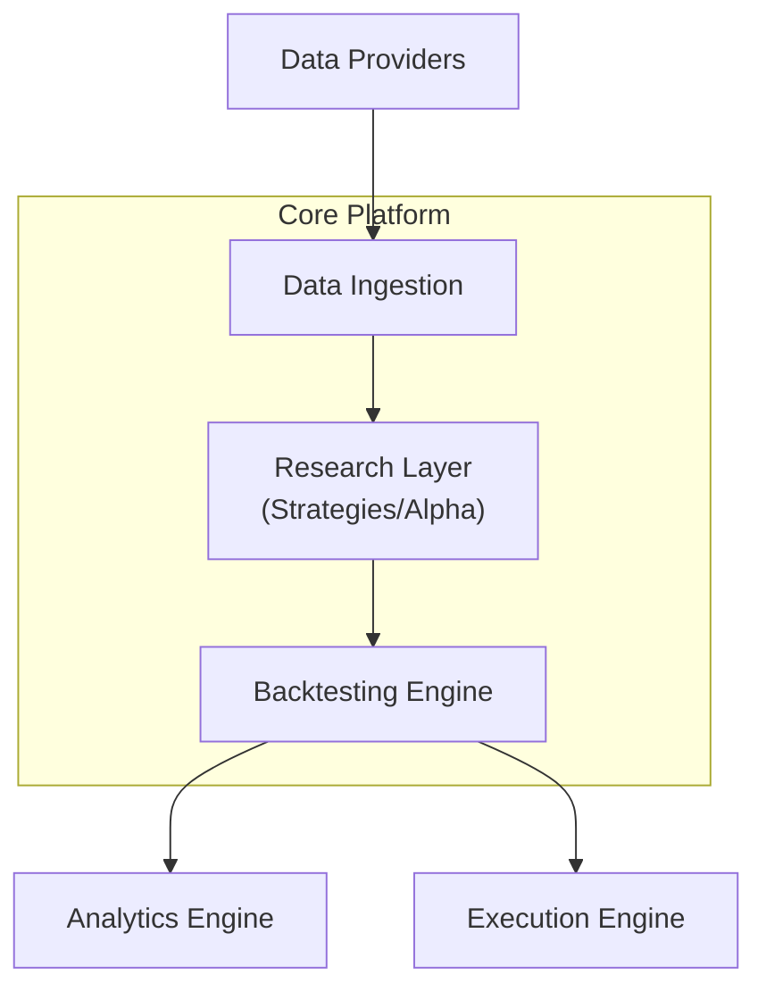

# Algorithmic Trading Research & Execution Platform

A modular research and execution system for developing, testing, and deploying algorithmic trading strategies. The platform is designed to support rapid experimentation, reproducible research, and eventual integration with live or paper trading environments.

This project prioritizes **correctness, observability, and extensibility** over premature complexity.

---

## Status

**Phase:** Early Stage (Architecture + Foundation)
**Version:** 0.1.0
**Stability:** Experimental / Under Active Development

---

## Problem Statement

Algorithmic trading workflows are often fragmented:

* Research happens in notebooks
* Backtesting is inconsistent or non-reproducible
* Execution logic is tightly coupled to strategy code
* No clear separation between data, research, and execution layers

This leads to:

* Poor reproducibility
* Difficulty scaling strategies
* High cognitive overhead when iterating

---

## Solution

This platform introduces a **clean separation of concerns**:

* **Data Layer** → market data ingestion, normalization, storage
* **Research Layer** → strategy development & experimentation
* **Backtesting Engine** → deterministic simulation of strategies
* **Execution Layer** → paper/live trading adapters
* **Analytics Layer** → performance metrics, risk analysis, reporting

Everything is designed to be:

* Modular
* Testable
* Replaceable

---

## Core Features (Planned / In Progress)

### Data

* Market data ingestion (historical + real-time)
* Unified OHLCV schema
* Pluggable data providers (crypto, equities, etc.)

### Research

* Strategy interface abstraction
* Feature engineering pipeline
* Notebook + script-based experimentation support

### Backtesting

* Event-driven backtesting engine
* Transaction cost + slippage simulation
* Portfolio tracking engine

### Execution

* Paper trading support (first)
* Broker integration layer (later)
* Order management system (OMS)

### Analytics

* Sharpe ratio, drawdown, CAGR, volatility
* Trade-level analytics
* Strategy comparison tooling

---

## Architecture Overview


---

## Tech Stack (Initial Recommendation)

### Backend / Core

* Python 3.11+
* Pandas / NumPy
* Pydantic (data validation)
* FastAPI (optional API layer)

### Data

* Parquet (local storage)
* PostgreSQL (metadata + portfolio tracking)
* Redis (optional caching / streaming)

### Backtesting

* Custom event-driven engine (no dependency lock-in)

### DevOps

* Docker
* Docker Compose
* Makefile for automation

### Testing

* Pytest
* Hypothesis (property-based testing for strategy correctness)

---

## 📁 Repository Structure

```
algo-trading-platform/
│
├── docs/
│   ├── PRD.md
│   ├── DESIGN.md
│   ├── TECH_STACK.md
│
├── src/
│   ├── data/
│   ├── research/
│   ├── backtesting/
│   ├── execution/
│   ├── analytics/
│   └── common/
│
├── tests/
│
├── notebooks/
│
├── scripts/
│
├── docker/
│
├── docker-compose.yml
├── Makefile
├── requirements.txt
└── README.md
```

---

## 🚀 Getting Started

### 1. Clone the repo

```bash
git clone https://github.com/<your-username>/algo-trading-platform.git
cd algo-trading-platform
```

### 2. Create virtual environment

```bash
python -m venv .venv
source .venv/bin/activate
```

### 3. Install dependencies

```bash
pip install -r requirements.txt
```

### 4. Run tests

```bash
pytest
```

---

## Development Philosophy

This project follows these principles:

* **Separation of concerns is non-negotiable**
* **Backtests must be reproducible**
* **No hidden state in strategy logic**
* **Data integrity > feature complexity**
* **Start simple, scale deliberately**

---

## Roadmap

### Phase 1 — Foundation

* Repo setup + architecture finalization
* Data ingestion pipeline
* Basic backtesting engine

### Phase 2 — Research Layer

* Strategy interface design
* Feature pipeline system
* First baseline strategies

### Phase 3 — Analytics

* Performance dashboard
* Trade-level analysis tools

### Phase 4 — Execution Layer

* Paper trading system
* Broker API integration

### Phase 5 — Optimization

* Performance improvements
* Parallel backtesting
* Strategy parameter search

---

## Risks & Constraints

* Market data quality can break assumptions quickly
* Backtesting bias (lookahead, survivorship) must be actively guarded against
* Execution layer complexity can explode if not strictly abstracted
* Overengineering early will slow down validation of ideas

---

## Contributing

This is currently a solo engineering project. Contribution guidelines will be added once the architecture stabilizes.

---

## License

This project is licensed under the MIT License.

See the LICENSE file for full details.

---

## Final Note

This is not a “trading bot project”.

It is a **research system for systematically testing trading ideas**.

Execution is secondary. Correctness and reproducibility come first.

---
