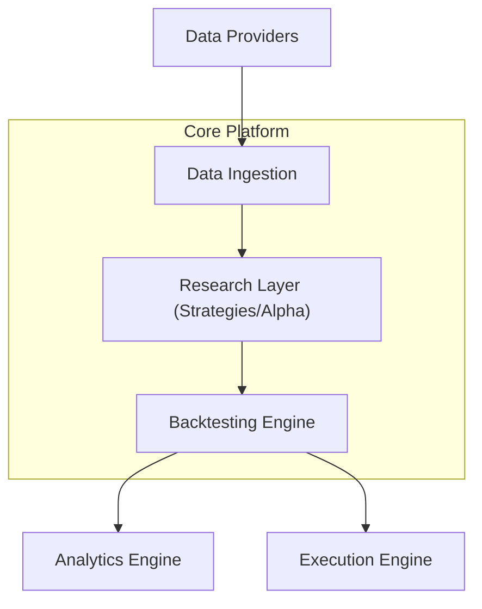

# Quant Data Platform


A production-grade financial data platform for market data ingestion, feature engineering, quantitative research, and strategy evaluation.

---

## Status

| Item       | Detail                          |
|------------|---------------------------------|
| Phase      | Early Stage (Architecture + Foundation) |
| Version    | 0.1.0                           |
| Stability  | Experimental / Under Active Development |

---

## Problem Statement

Algorithmic trading workflows are often fragmented:

- Research happens in notebooks
- Backtesting is inconsistent or non-reproducible
- Execution logic is tightly coupled to strategy code
- No clear separation between data, research, and execution layers

This leads to poor reproducibility, difficulty scaling strategies, and high cognitive overhead when iterating.

---

## Solution

This platform introduces a clean separation of concerns across five layers:

- **Data Layer** — market data ingestion, normalization, storage
- **Research Layer** — strategy development and experimentation
- **Backtesting Engine** — deterministic simulation of strategies
- **Execution Layer** — paper/live trading adapters
- **Analytics Layer** — performance metrics, risk analysis, reporting

Everything is designed to be modular, testable, and replaceable.

---

## Quick Example

> Note: The platform is in early development. The example below reflects the intended interface once the data ingestion and backtesting layers are functional.

```python
from quant.ingestion import fetch_ohlcv
from quant.backtesting import Backtest
from quant.strategies import SMACrossover
from quant.analytics import summarize

# Load historical data
data = fetch_ohlcv(symbol="BTC/USDT", start="2023-01-01", end="2024-01-01")

# Define and run a strategy
strategy = SMACrossover(short_window=10, long_window=50)
result = Backtest(data, strategy).run()

# Inspect performance
summarize(result)
# Sharpe: 1.42 | CAGR: 34.1% | Max Drawdown: -18.3%
```

---

## Feature Status

### Data

| Feature                              | Status      |
|--------------------------------------|-------------|
| Historical market data ingestion     | Planned     |
| Unified OHLCV schema                 | In Progress |
| Pluggable data providers             | Planned     |

### Research

| Feature                              | Status      |
|--------------------------------------|-------------|
| Strategy interface abstraction       | In Progress |
| Feature engineering pipeline         | Planned     |
| Notebook + script experimentation    | Planned     |

### Backtesting

| Feature                              | Status      |
|--------------------------------------|-------------|
| Event-driven backtesting engine      | In Progress |
| Transaction cost + slippage sim      | Planned     |
| Portfolio tracking engine            | Planned     |

### Execution

| Feature                              | Status      |
|--------------------------------------|-------------|
| Paper trading support                | Planned     |
| Broker integration layer             | Planned     |
| Order management system (OMS)        | Planned     |

### Analytics

| Feature                              | Status      |
|--------------------------------------|-------------|
| Sharpe, drawdown, CAGR, volatility   | Planned     |
| Trade-level analytics                | Planned     |
| Strategy comparison tooling          | Planned     |

---

## Architecture Overview



---

## Tech Stack

### Backend / Core

- Python 3.11+
- Pandas / NumPy
- Pydantic (data validation)
- FastAPI (optional API layer)

### Data

- Parquet (local storage)
- PostgreSQL (metadata + portfolio tracking)
- Redis (optional caching / streaming)

### Backtesting

- Custom event-driven engine (no dependency lock-in)

### DevOps

- Docker + Docker Compose
- Makefile for automation

### Testing

- Pytest
- Hypothesis (property-based testing for strategy correctness)

---

## Repository Structure

```
quant-data-platform/
├── docs/
│   ├── PRD.md
│   ├── DESIGN.md
│   ├── TECH_STACK.md
│   └── ROADMAP.md
│
├── src/
│   ├── ingestion/
│   ├── pipelines/
│   ├── storage/
│   ├── features/
│   ├── backtesting/
│   ├── analytics/
│   ├── api/
│   └── common/
│
├── flows/
├── tests/
├── notebooks/
│
├── infrastructure/
│   ├── docker/
│   ├── grafana/
│   ├── prometheus/
│   └── compose/
│
├── .github/
│   └── workflows/
│
├── docker-compose.yml
├── Makefile
├── requirements.txt
├── README.md
└── LICENSE
```

---

## Getting Started

### 1. Clone the repository

```bash
git clone https://github.com/yamkela-macwili/quant-data-platform.git
cd quant-data-platform
```

### 2. Create a virtual environment

```bash
python -m venv .venv
source .venv/bin/activate
```

### 3. Install dependencies

```bash
pip install -r requirements.txt
```

### 4. Run tests

```bash
pytest
```

---

## Roadmap

### Phase 1 — Foundation (Current)

- Repo setup and architecture finalization
- Data ingestion pipeline
- Basic backtesting engine

### Phase 2 — Research Layer

- Strategy interface design
- Feature pipeline system
- First baseline strategies

### Phase 3 — Analytics

- Performance dashboard
- Trade-level analysis tools

### Phase 4 — Execution Layer

- Paper trading system
- Broker API integration

### Phase 5 — Optimization

- Performance improvements
- Parallel backtesting
- Strategy parameter search

---

## Development Philosophy

- Separation of concerns is non-negotiable
- Backtests must be reproducible
- No hidden state in strategy logic
- Data integrity takes priority over feature complexity
- Start simple, scale deliberately

---

## Risks and Constraints

- Market data quality can break assumptions quickly
- Backtesting bias (lookahead, survivorship) must be actively guarded against
- Execution layer complexity can escalate if not strictly abstracted
- Overengineering early will slow validation of ideas

---

## Contributing

This is currently a solo engineering project. The architecture is still stabilizing, so the contribution workflow is not yet formalized.

If you find a bug or have a suggestion, feel free to [open an issue](https://github.com/yamkela-macwili/quant-data-platform/issues). Pull requests may be considered once Phase 1 is complete.

---

## License

This project is licensed under the MIT License. See the [LICENSE](./LICENSE) file for full details.

---

## Final Note

This is not a trading bot.

It is a research system for systematically testing trading ideas. Execution is secondary. Correctness and reproducibility come first.