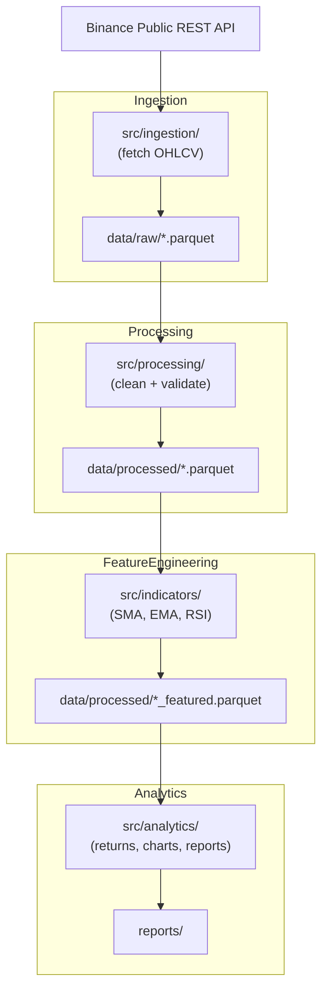

# Design - Quant Data Platform

## Architecture

## Module Responsibilities

| Module | Responsibility |
|--------|---------------|
| `src/ingestion/binance.py` | Paginated fetch from Binance `/api/v3/klines` |
| `src/processing/cleaner.py` | Dedup, null-drop, sort |
| `src/processing/validator.py` | Data integrity checks |
| `src/indicators/pipeline.py` | Orchestrate SMA/EMA/RSI |
| `src/analytics/charts.py` | Matplotlib chart output |
| `src/analytics/returns.py` | Returns and volatility |
| `src/analytics/summary.py` | Top moves, indicator snapshots |

## Data Storage

- **Format:** Parquet (via `pyarrow`)
- **Raw:** `data/raw/`
- **Processed:** `data/processed/`
- **Reports:** `reports/`

